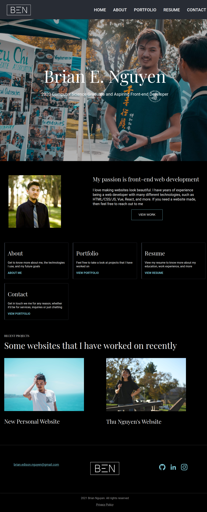
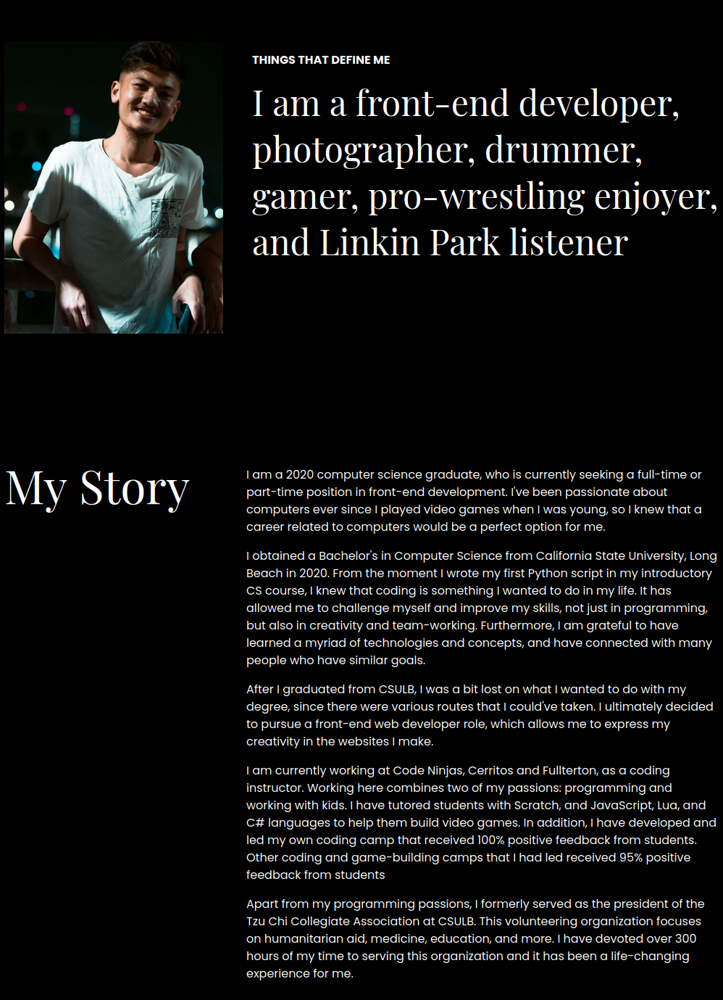
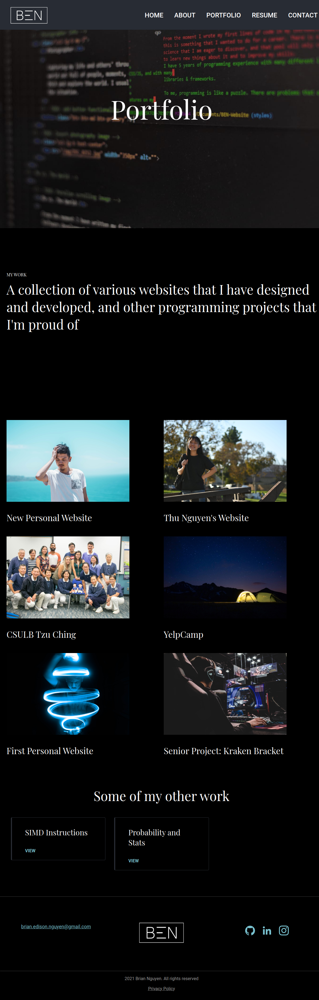
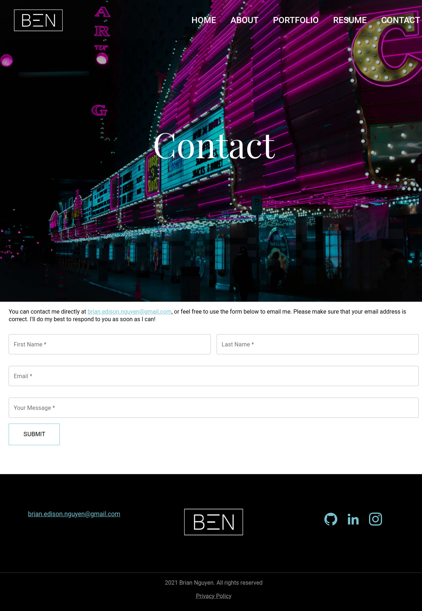

<h1 align='center'>My Personal Website</h1>
<h2 align='center'>Redesigned and Redeveloped with React.js</h2>

Link to website: <a href="https://brianenguyen.com/" target="_blank">brianenguyen.com</a>

My personal website / portfolio that showcases information about me and my
programming work

## Pages

1. Home
2. About
3. Portfolio

- All Elite Network
- Frontend Mentor Challenges
- New Personal Website
- Thu Nguyen's Website
- CSULB Tzu Ching
- YelpCamp
- First Personal Website
- Kraken Bracket
- SIMD Instructions
- Probability and Stats computing

4. Blog
5. Contact

## Download and Installation

The instructions below assumes you are using a terminal and you have Node installed

```sh
$ git clone https://github.com/Buraiyen/BEN-Website-React.git
...
$ cd BEN-Website-React/
$ npm i
$ npm run dev
```

## Technologies Used

- [React.js](https://reactjs.org/)
- [React Router](https://reactrouter.com/en/main)
- [Material UI](https://mui.com/)
- [EmailJS](https://www.emailjs.com/)
- [Vite](https://vitejs.dev/)

## Licensing

Feel free to inspect my code and reuse what is appropriate. Any image files that
have the `BEN_` or `BEN-` prefix are my original content. If you wish to use
these images, please inform me on which images to use and why you're
using them. All other directories and files are MIT Licensed (where applicable).
See the [LICENSE](./LICENSE) for more information

## Images





